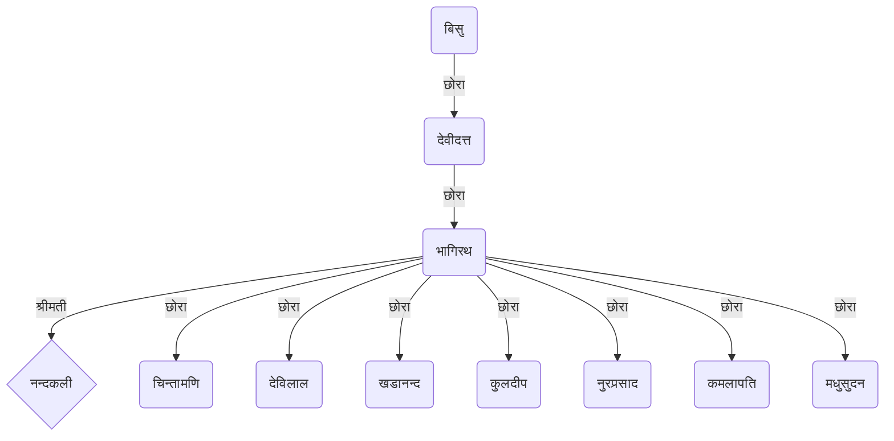

```mermaid
flowchart TD
%% GP2, GP1, P1 + P2,  
    GP2(बिसु)-->|छोरा| GP1(देवीदत्त) 
    GP1 --> |छोरा| P1(भागिरथ)
    P1 --> |श्रीमती| P2{नन्दकली}

    P1 -->  |छोरा| S1(चिन्तामणि)
    P1 -->  |छोरा| S7(देविलाल)
    P1 -->  |छोरा| S2(खडानन्द)
    P1 -->  |छोरा| S3(कुलदीप)
    P1 -->  |छोरा| S4(नुरप्रसाद)
    P1 -->  |छोरा| S5(कमलापति)
    P1 -->  |छोरा| S6(मधुसुदन)
    %%|श्रीमती| DX{हरिकला}
    %% A -->  C()
    
```