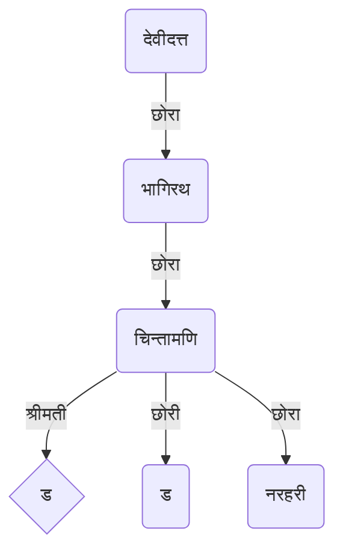

```mermaid
flowchart TD
%% GP2, GP1, P1 + P2,  
    GP2(देवीदत्त)-->|छोरा| GP1(भागिरथ) 
    GP1 --> |छोरा| P1(चिन्तामणि)
    P1 --> |श्रीमती| P2{ड}

    P1 --> |छोरी| D1(ड)
    P1 -->  |छोरा| S1(नरहरी)
    
    

    %%|श्रीमती| DX{हरिकला}
    %% A -->  C()
    
```