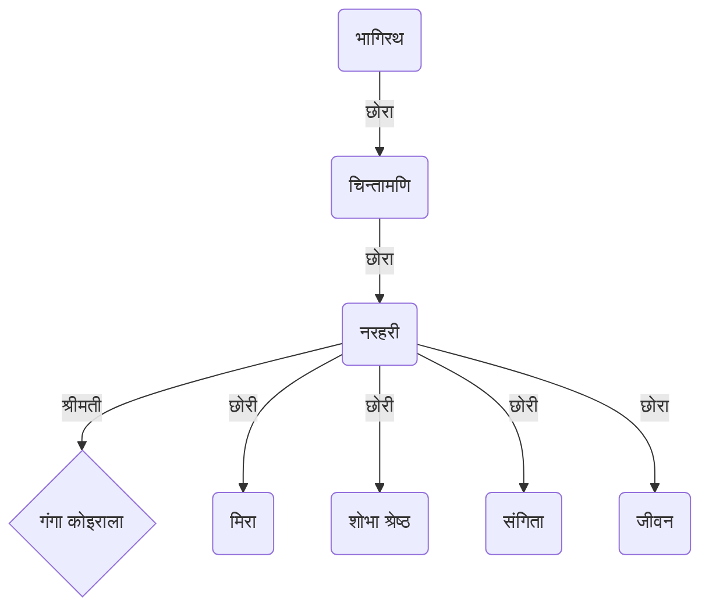

```mermaid
flowchart TD
%% GP2, GP1, P1 + P2,  
    GP2(भागिरथ)-->|छोरा| GP1(चिन्तामणि) 
    GP1 --> |छोरा| P1(नरहरी)
    P1 --> |श्रीमती| P2{गंगा कोइराला}

    
    
    P1 --> |छोरी| D1(मिरा)
    P1 --> |छोरी| D2(शोभा श्रेष्ठ)
    P1 --> |छोरी| D3(संगिता)
    P1 -->  |छोरा| S1(जीवन)

    %%|श्रीमती| DX{हरिकला}
    %% A -->  C()
    
```