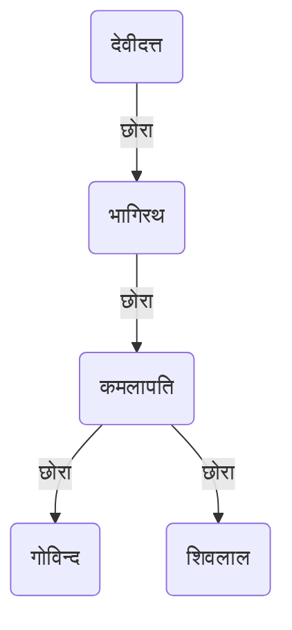

```mermaid
flowchart TD
%% GP2, GP1, P1 + P2,  
    GP2(देवीदत्त)-->|छोरा| GP1(भागिरथ) 
    GP1 --> |छोरा| P1(कमलापति)
    %% P1 --> |श्रीमती| P2{ड}

    
    P1 -->  |छोरा| S1(गोविन्द)
    P1 --> |छोरा| S2(शिवलाल)
    

    %% P2 --> A@{ shape: comment, label: "कास्कीकोट, कास्की" }

    
    %%|श्रीमती| DX{हरिकला}
    %% A -->  C()
    
```