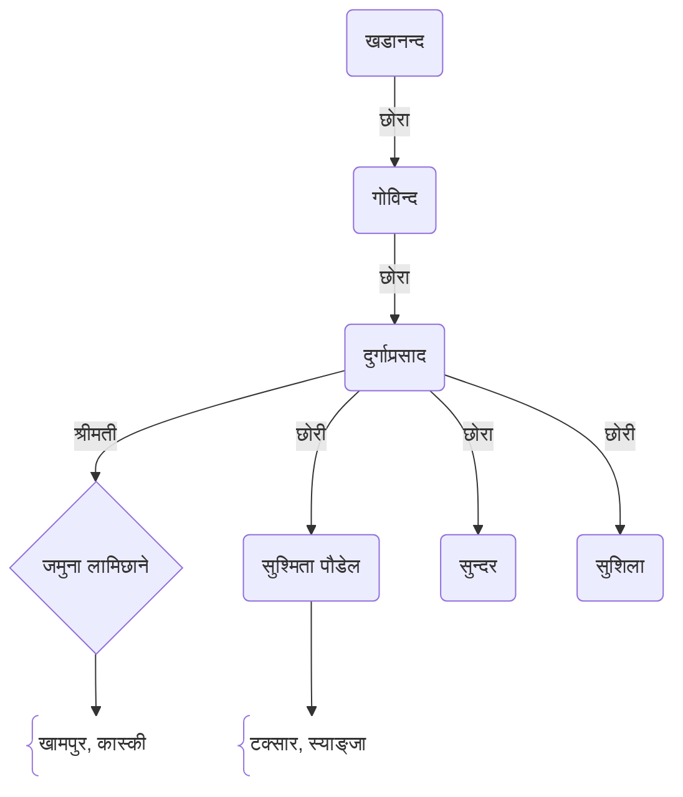

```mermaid
flowchart TD
%% GP2, GP1, P1 + P2,  
    GP2(खडानन्द)-->|छोरा| GP1(गोविन्द) 
    GP1 --> |छोरा| P1(दुर्गाप्रसाद)
    P1 --> |श्रीमती| P2{जमुना लामिछाने}

    
    P1 --> |छोरी| D1(सुश्मिता पौडेल)
    P1 --> |छोरा| S1(सुन्दर)
    P1 --> |छोरी| D2(सुशिला)
    
    
    

    P2 --> A@{ shape: comment, label: "खामपुर, कास्की" }

    D1 --> B@{ shape: comment, label: "टक्सार, स्याङ्जा" }
    
    
    %%|श्रीमती| DX{हरिकला}
    %% A -->  C()
    
```