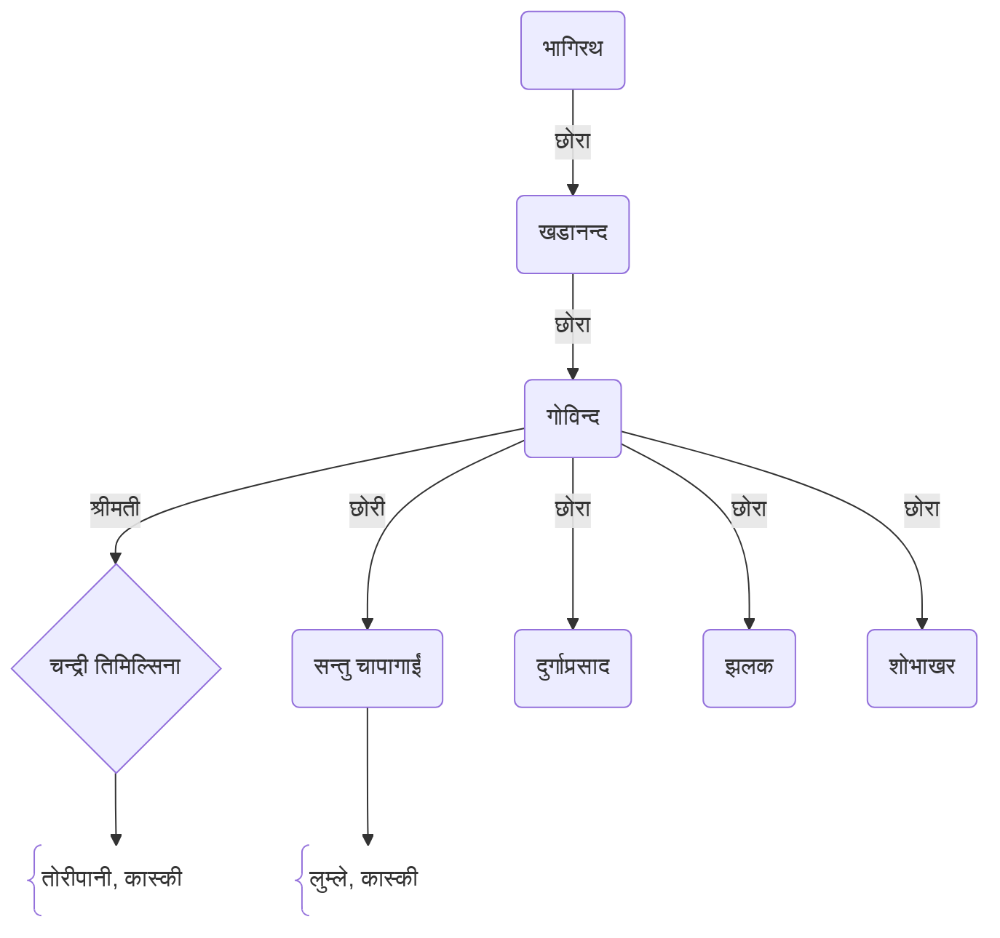

```mermaid
flowchart TD
%% GP2, GP1, P1 + P2,  
    GP2(भागिरथ)-->|छोरा| GP1(खडानन्द) 
    GP1 --> |छोरा| P1(गोविन्द)
    P1 --> |श्रीमती| P2{चन्द्री तिमिल्सिना}

    
    P1 --> |छोरी| D1(सन्तु चापागाईँ)
    P1 --> |छोरा| S1(दुर्गाप्रसाद)
    P1 --> |छोरा| S2(झलक)
    P1 --> |छोरा| S3(शोभाखर)
    
    

    P2 --> A@{ shape: comment, label: "तोरीपानी, कास्की" }

    D1 --> B@{ shape: comment, label: "लुम्ले, कास्की" }
    
    
    %%|श्रीमती| DX{हरिकला}
    %% A -->  C()
    
```