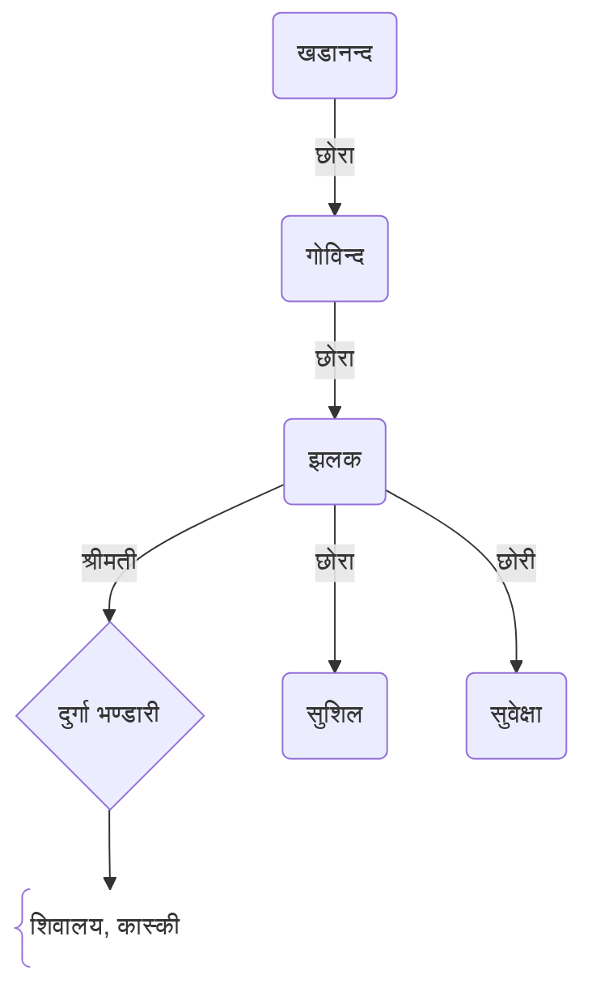

```mermaid
flowchart TD
%% GP2, GP1, P1 + P2,  
    GP2(खडानन्द)-->|छोरा| GP1(गोविन्द) 
    GP1 --> |छोरा| P1(झलक)
    P1 --> |श्रीमती| P2{दुर्गा भण्डारी}

    
    
    P1 --> |छोरा| S1(सुशिल)
    P1 --> |छोरी| D1(सुवेक्षा)
    
    
    

    P2 --> A@{ shape: comment, label: "शिवालय, कास्की" }


    
    
    %%|श्रीमती| DX{हरिकला}
    %% A -->  C()
    
```