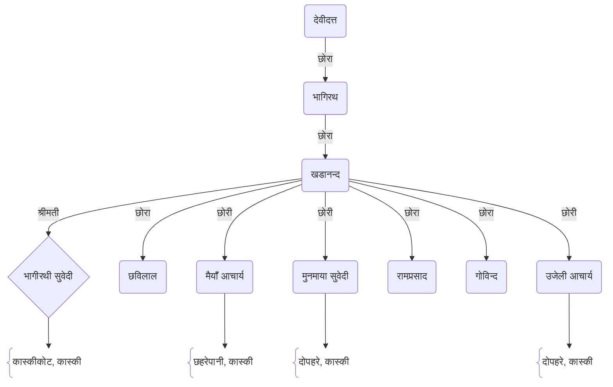

```mermaid
flowchart TD
%% GP2, GP1, P1 + P2,  
    GP2(देवीदत्त)-->|छोरा| GP1(भागिरथ) 
    GP1 --> |छोरा| P1(खडानन्द)
    P1 --> |श्रीमती| P2{भागीरथी सुवेदी}

    
    P1 -->  |छोरा| S1(छविलाल)
    P1 --> |छोरी| D1(मैयाँ आचार्य)
    P1 --> |छोरी| D2(मुनमाया सुवेदी)
    P1 --> |छोरा| S2(रामप्रसाद)
    P1 --> |छोरा| S3(गोविन्द)
    P1 --> |छोरी| D3(उजेली आचार्य)


    P2 --> A@{ shape: comment, label: "कास्कीकोट, कास्की" }

    D1 --> B@{ shape: comment, label: "छहरेपानी, कास्की" }
    
    D2 --> C@{ shape: comment, label: "दोपहरे, कास्की" }
    
    D3 --> D@{ shape: comment, label: "दोपहरे, कास्की" }
    
    %%|श्रीमती| DX{हरिकला}
    %% A -->  C()
    
```