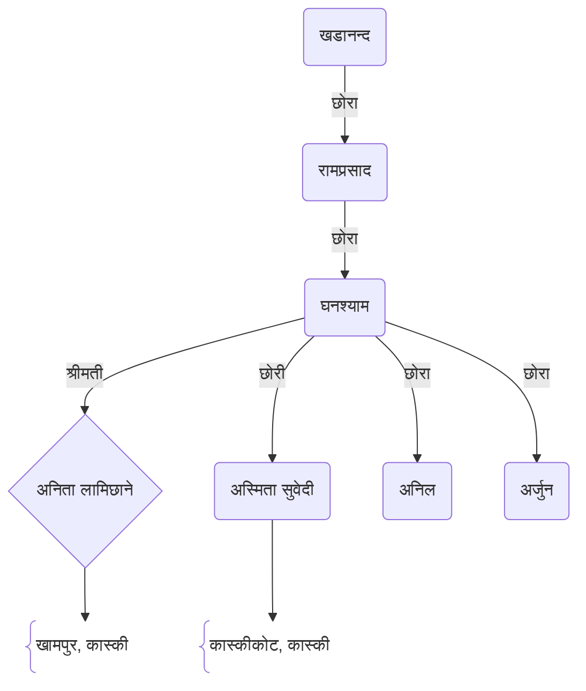

```mermaid
flowchart TD
%% GP2, GP1, P1 + P2,  
    GP2(खडानन्द)-->|छोरा| GP1(रामप्रसाद) 
    GP1 --> |छोरा| P1(घनश्याम)
    P1 --> |श्रीमती| P2{अनिता लामिछाने}

    
    P1 --> |छोरी| D1(अस्मिता सुवेदी)
    P1 --> |छोरा| S1(अनिल)
    P1 --> |छोरा| S2(अर्जुन)
    

    P2 --> A@{ shape: comment, label: "खामपुर, कास्की" }

    D1 --> B@{ shape: comment, label: "कास्कीकोट, कास्की" }
    
    
    %%|श्रीमती| DX{हरिकला}
    %% A -->  C()
    
```