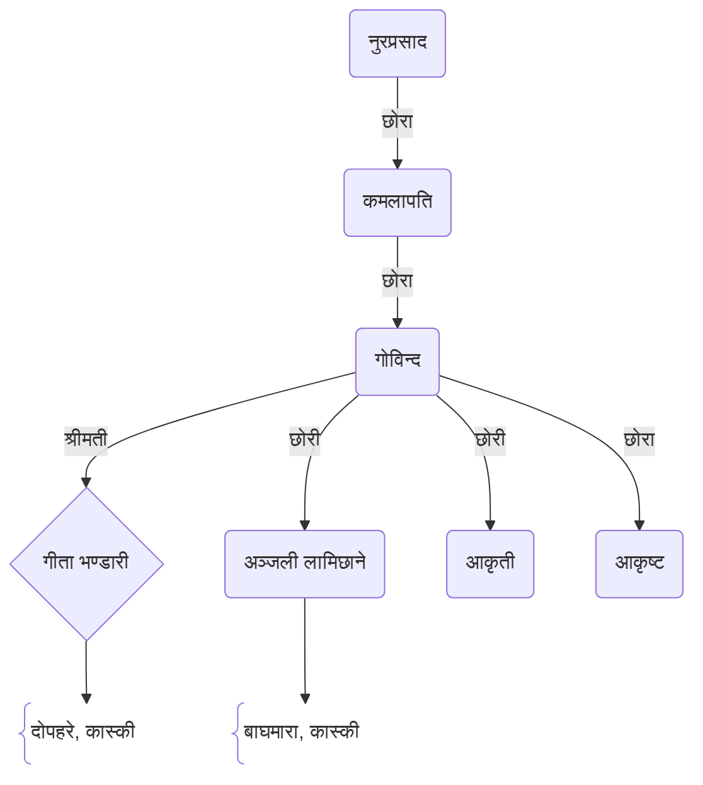

```mermaid
flowchart TD
%% GP2, GP1, P1 + P2,  
    GP2(नुरप्रसाद)-->|छोरा| GP1(कमलापति) 
    GP1 --> |छोरा| P1(गोविन्द)
    P1 --> |श्रीमती| P2{गीता भण्डारी}

    P1 --> |छोरी| D1(अञ्जली लामिछाने)
    P1 --> |छोरी| D2(आकृती)
    P1 -->  |छोरा| S1(आकृष्ट)
    
    
    

    P2 --> A@{ shape: comment, label: "दोपहरे, कास्की" }
    D1 --> B@{ shape: comment, label: "बाघमारा, कास्की" }

    %%|श्रीमती| DX{हरिकला}
    %% A -->  C()
    
```