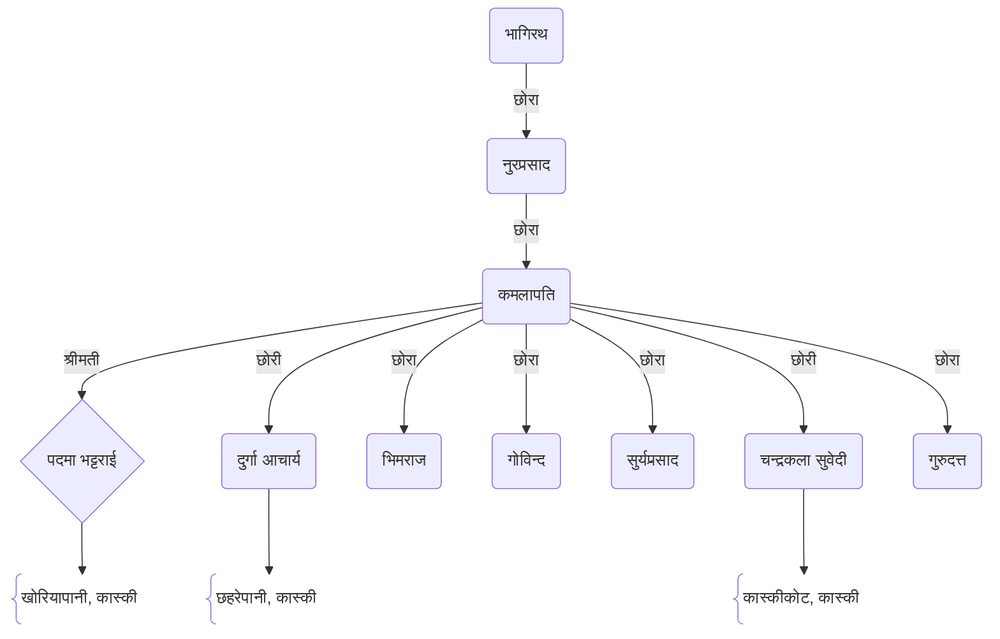

```mermaid
flowchart TD
%% GP2, GP1, P1 + P2,  
    GP2(भागिरथ)-->|छोरा| GP1(नुरप्रसाद) 
    GP1 --> |छोरा| P1(कमलापति)
    P1 --> |श्रीमती| P2{पदमा भट्टराई}

    P1 --> |छोरी| D1(दुर्गा आचार्य)
    P1 -->  |छोरा| S1(भिमराज)
    P1 --> |छोरा| S2(गोविन्द)
    P1 --> |छोरा| S3(सुर्यप्रसाद)
    P1 --> |छोरी| D2(चन्द्रकला सुवेदी)
    P1 --> |छोरा| S4(गुरुदत्त)

    D2 --> A@{ shape: comment, label: "कास्कीकोट, कास्की" }
    P2 --> B@{ shape: comment, label: "खोरियापानी, कास्की" }
    D1 --> C@{ shape: comment, label: "छहरेपानी, कास्की" }

    %%|श्रीमती| DX{हरिकला}
    %% A -->  C()
    
```