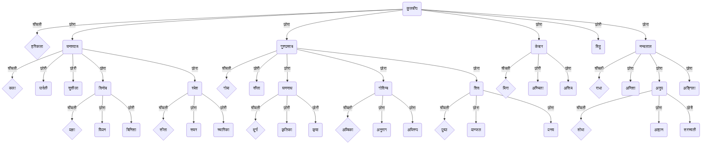

```mermaid
flowchart TD

    D(कुलदीप)--> |श्रीमती| DX{हरिकला}
    %% A -->  C()
    D --> |छोरा| B(घनश्याम)
    D --> |छोरा|C(गुरुप्रसाद)
    D --> |छोरा|E(केदार)
    D --> |छोरी|G(मिठू)
    D --> |छोरा|F(नन्दलाल)

    B --> |श्रीमती|BX{कला}
    C --> |श्रीमती|CX{गोमा}
    E --> |श्रीमती|EX{मिरा}
    F --> |श्रीमती|FX{राधा}
    
    B --> |छोरी|BA(पार्वती)
    B --> |छोरी|BB(सुशीला)
    B --> |छोरा|BC(विनोद)
    B --> |छोरा|BD(रमेश)    
    
    C --> |छोरी|CA(सीता)
    C --> |छोरा|CB(घननाथ)
    C --> |छोरा|CC(गोविन्द)
    C --> |छोरा|CD(शिव)

    E --> |छोरी|EA(अस्मिता)
    E --> |छोरा|EB(असिम)
    
    F --> |छोरा|FA(अनिशा)
    F --> |छोरा|FB(अनुप)
    F --> |छोरा|FC(अङ्गिता)

    BC --> |श्रीमती|BCX{प्रज्ञा}
    BC --> |छोरा|BCA(विप्रन)
    BC --> |छोरी|BCB(बिनिशा)

    BD --> |श्रीमती|BDX{सीता}
    BD --> |छोरा|BDA(समर)
    BD --> |छोरी|BDB(स्मारिका)

    CB --> |श्रीमती|CBX{दुर्गा}
    CB --> |छोरी|CBA(कृतिका)
    CB --> |छोरी|CBB(कृषा)

    CC --> |श्रीमती|CCX{अम्बिका}
    CC --> |छोरा|CCA(अनुराग)
    CC --> |छोरा|CCB(अभिरुप)

    CD --> |श्रीमती|CDX{पुष्पा}
    CD --> |छोरा|CDA(प्रान्जल)
    CD --> |छोरा|CDB(प्रनव)

    FB --> |श्रीमती|FBX{शोभा}
    FB --> |छोरा|FBA(आहान)
    FB --> |छोरी|FBB(सरस्वती)


```
पार्वती
सुशीला

घननाथ
गोविन्द
शिव
असिम
अस्मिता